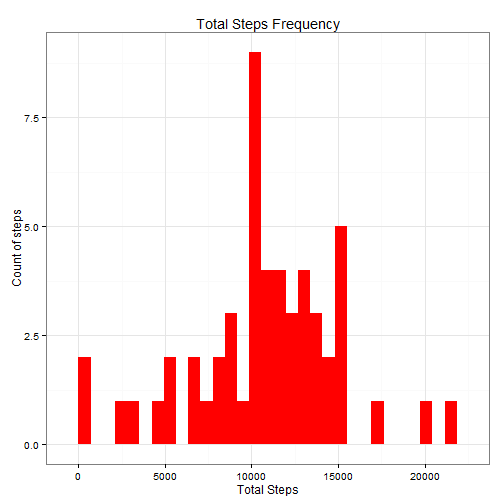
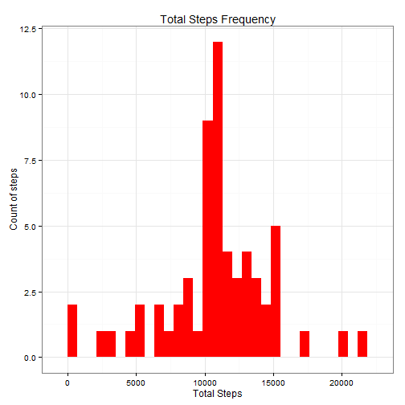

#Peer Assignment 1: Analyzing personal activity

This assignment analyzes data from a personal activity monitoring device. This device collects data at 5 minute intervals through out the data. The data consists of two months of data from an anonymous individual collected during the months of October and November, 2012 and include the number of steps taken in 5 minute intervals each day.

##1.Loading and preprocessing the data

The data for this assignment can be downloaded from the github site:

<https://github.com/rdpeng/RepData_PeerAssessment1>

Once you download and unzip dataset *activity.csv* (stored in a comma-separated-value CSV form) in your working directory then load the data using the following command in R. The code below describes how to set your working directory, read the data into the file called "data" and load the necessary libraries that we will need for subsequent analysis.


```r
setwd("C:/COURSERA/REPRO_RESEARCH/RepData_PeerAssessment1")

data<-read.csv(unz("C:/COURSERA/REPRO_RESEARCH/RepData_PeerAssessment1/activity.zip","activity.csv"))
library("data.table")
library("dplyr")
library("ggplot2")
library("xtable") # Not used but can be used for creating table in markdown
```


The variables included in this dataset are:

* steps: Number of steps taking in a 5-minute interval (missing values are coded as NA)
* date: The date on which the measurement was taken in YYYY-MM-DD format
* interval: Identifier for the 5-minute interval in which measurement was taken

There are a total of 17,568 observations in this dataset with some missing.

##2.What is mean total number of steps taken per day?

For this part of the assignment, we ignore the missing values in the dataset.

###2.1.Calculate the total number of steps taken per day

First filter out missing observations and show first few rows of the table


```r
#Filter NA observations
ccases<-complete.cases(data)
data1<-data[ccases,]
head(data1)
```

```
##     steps       date interval
## 289     0 2012-10-02        0
## 290     0 2012-10-02        5
## 291     0 2012-10-02       10
## 292     0 2012-10-02       15
## 293     0 2012-10-02       20
## 294     0 2012-10-02       25
```

Then use data.table package to calculate total steps per day and see first rows


```r
data1<-as.data.table(data1)
perday<-data1[,.(total_steps = sum(steps)),by=.(date)]
head(perday)
```

```
##          date total_steps
## 1: 2012-10-02         126
## 2: 2012-10-03       11352
## 3: 2012-10-04       12116
## 4: 2012-10-05       13294
## 5: 2012-10-06       15420
## 6: 2012-10-07       11015
```


###2.2. Make a histogram of the total number of steps taken each day

In this part use data frame "perday" that includes total steps to create a histogram of total steps each day 

```r
#Using ggplot
g<-ggplot(perday, aes(total_steps)) 
g+geom_histogram(fill="red")+ 
labs(title = "Total Steps Frequency")+
labs(x="Total Steps")+
labs(y="Count of steps")+
theme_bw(base_family = "Times")
```

 

###2.3.Calculate and report the mean and median of the total number of steps taken per day

In this section I calculate the mean and median number of steps per day. I thus use the data grouped earlier on per day basis and calculate the mean and median total steps 


```r
mean_total<-mean(perday$total_steps) 
median_total<-median(perday$total_steps) 
mean_total
```

```
## [1] 10766.19
```

```r
median_total
```

```
## [1] 10765
```


##3.What is the average daily activity pattern?

###3.1.Time series plot (i.e. type = "l") of the 5-minute interval (x-axis) and the average number of steps taken, averaged across all days (y-axis)

Here, I first calculate and then plot the average steps by interval over all days in the sample

```r
data1<-as.data.table(data1)
perinterval<-data1[,.(mean_interval = mean(steps)),by=.(interval)]
head(perinterval)
```

```
##    interval mean_interval
## 1:        0     1.7169811
## 2:        5     0.3396226
## 3:       10     0.1320755
## 4:       15     0.1509434
## 5:       20     0.0754717
## 6:       25     2.0943396
```

```r
plot(perinterval$interval,perinterval$mean_interval,type="l",xlab="5-min Interval", ylab="Average steps")
```

 

###3.2.Which 5-minute interval, on average across all the days in the dataset, contains the maximum number of steps?

Here I find the interval with the largest average number of steps. I perform the calculation using two ways that confirm the same result

```r
# Find index for max interval
max_int<-max(perinterval$mean_interval)
max_int_index<-perinterval$mean_interval==max_int
perinterval[max_int_index,]
```

```
##    interval mean_interval
## 1:      835      206.1698
```

```r
# or get it immediately as follows
perinterval[mean_interval==max(mean_interval),]
```

```
##    interval mean_interval
## 1:      835      206.1698
```

##4.Imputing missing values

There are a number of days/intervals where there are missing values (coded as NA). The presence of missing days may introduce bias into some calculations or summaries of the data.

###4.1.Calculate and report the total number of missing values in the dataset (i.e. the total number of rows with NAs)

The total number of missing observation in percent is given below:

```r
missing<-1-sum(complete.cases(data))/nrow(data)
missing
```

```
## [1] 0.1311475
```

###4.2.Devise a strategy for filling in all of the missing values in the dataset. The strategy does not need to be sophisticated. For example, you could use the mean/median for that day, or the mean for that 5-minute interval, etc.

My strategy is to locate the missing number rows using na_index1 variable and the interval that corresponds to this missing observation. I will subsequently replace the missing values with the average value taken from non-missing observations for the corresponding interval.

Here is the code for locating missing data:

```r
data<-as.data.table(data)
na_index1<-which(is.na(data$steps)) #returns the row index of missing values
na_interval1<-data[na_index1,interval] #saves the interval of each NA missing value
```

###4.3.Create a new dataset that is equal to the original dataset but with the missing data filled in.

First I save my original data into a new data frame called test. 
I then take the average steps taken per interval for the whole sample of non-missing data and save all in new data frame test1.
Finally, I go back to the original data saved in test and replace missing values with the sample means of non-missing data.


```r
test<-data #so that I do not touch original data
test<-as.data.table(test)
test1<-test[,.(mean_interval = mean(steps,na.rm=TRUE)),by=.(interval)] #calculate mean steps per intervals and save it in  a new data table

check_interval<-as.integer()
test$steps<-as.numeric(test$steps)

#The following replaces missing values with means of corresponding interval
for (i in na_index1)
{

  check_interval[i]<-test[i,interval]
  test[i,"steps"]<- test1[interval==check_interval[i],mean_interval]

}
head(test)
```

```
##        steps       date interval
## 1: 1.7169811 2012-10-01        0
## 2: 0.3396226 2012-10-01        5
## 3: 0.1320755 2012-10-01       10
## 4: 0.1509434 2012-10-01       15
## 5: 0.0754717 2012-10-01       20
## 6: 2.0943396 2012-10-01       25
```

###4.4.Make a histogram of the total number of steps taken each day and Calculate and report the mean and median total number of steps taken per day. Do these values differ from the estimates from the first part of the assignment? What is the impact of imputing missing data on the estimates of the total daily number of steps?

Here I first create a new histogram using the data with imputed missing numbers that were saved on data set "test" earlier. I then find the new mean and median with imputed missing numbers.

```r
perday_new<-test[,.(total_steps = sum(steps)),by=.(date)]
head(perday_new)
```

```
##          date total_steps
## 1: 2012-10-01    10766.19
## 2: 2012-10-02      126.00
## 3: 2012-10-03    11352.00
## 4: 2012-10-04    12116.00
## 5: 2012-10-05    13294.00
## 6: 2012-10-06    15420.00
```

```r
#Using ggplot to plot per day steps
g<-ggplot(perday_new, aes(total_steps)) 
g+geom_histogram(fill="red")+ 
  labs(title = "Total Steps Frequency")+
  labs(x="Total Steps")+
  labs(y="Count of steps")+
  theme_bw(base_family = "Times")
```

 

```r
#Calculate mean and median steps per day
head(perday_new)
```

```
##          date total_steps
## 1: 2012-10-01    10766.19
## 2: 2012-10-02      126.00
## 3: 2012-10-03    11352.00
## 4: 2012-10-04    12116.00
## 5: 2012-10-05    13294.00
## 6: 2012-10-06    15420.00
```

```r
mean_total_new<-mean(perday_new$total_steps) 
median_total_new<-median(perday_new$total_steps) 
mean_total_new
```

```
## [1] 10766.19
```

```r
median_total_new
```

```
## [1] 10766.19
```

The mean and median values do not change significantly compared to the case with calculations performed on non-missing values alone.

##5.Are there differences in activity patterns between weekdays and weekends?
For this part the weekdays() function is used. I use the dataset with the filled-in missing values for this part.

###5.1.Create a new factor variable in the dataset with two levels - "weekday" and "weekend" indicating whether a given date is a weekday or weekend day.

I perform a new factor called weekend_factor that has two levels "weekday" and "weekend". I then show the first rows of the new data frame with the included factor (which also includes the day of the week in seperate column to verify the factor is right)

```r
final<-test
final$date<-as.character(final$date)
final$date<-as.Date(final$date,format="%Y-%m-%d")
final$day <- weekdays(as.Date(final$date))

for (i in 1:nrow(final))
{
  if (final$day[i]=="Saturday" | final$day[i]=="Sunday")
  {
    final$weekend_factor[i]="weekend"
  }
  else
  {
    final$weekend_factor[i]="weekday"
  }
  
}
head(final,2000)
```

```
##           steps       date interval    day weekend_factor
##    1: 1.7169811 2012-10-01        0 Monday        weekday
##    2: 0.3396226 2012-10-01        5 Monday        weekday
##    3: 0.1320755 2012-10-01       10 Monday        weekday
##    4: 0.1509434 2012-10-01       15 Monday        weekday
##    5: 0.0754717 2012-10-01       20 Monday        weekday
##   ---                                                    
## 1996: 0.0000000 2012-10-07     2215 Sunday        weekend
## 1997: 0.0000000 2012-10-07     2220 Sunday        weekend
## 1998: 0.0000000 2012-10-07     2225 Sunday        weekend
## 1999: 0.0000000 2012-10-07     2230 Sunday        weekend
## 2000: 0.0000000 2012-10-07     2235 Sunday        weekend
```


###5.2.Make a panel plot containing a time series plot (i.e. type = "l") of the 5-minute interval (x-axis) and the average number of steps taken, averaged across all weekday days or weekend days (y-axis). See the README file in the GitHub repository to see an example of what this plot should look like using simulated data.

First I calculate the average number of steps across intervals and whether weekday or weekend using weekend factor.

```r
final1<-final
final1<-final[,.(avg_steps=mean(steps)),by=.(interval,weekend_factor)]
head(final1)
```

```
##    interval weekend_factor  avg_steps
## 1:        0        weekday 2.25115304
## 2:        5        weekday 0.44528302
## 3:       10        weekday 0.17316562
## 4:       15        weekday 0.19790356
## 5:       20        weekday 0.09895178
## 6:       25        weekday 1.59035639
```

I then use ggplot2 to create a plot of average steps with facet being the weekend factor, i.e., broken down by whether it weekday or weekend.


```r
gweek<-ggplot(final1,aes(interval,avg_steps))
gweek+geom_point()+
facet_grid(.~weekend_factor)+
geom_line()+
labs(title="Average number of steps per 5 minute interval")+
labs(x="Interval",y="Average Steps")
```

 
